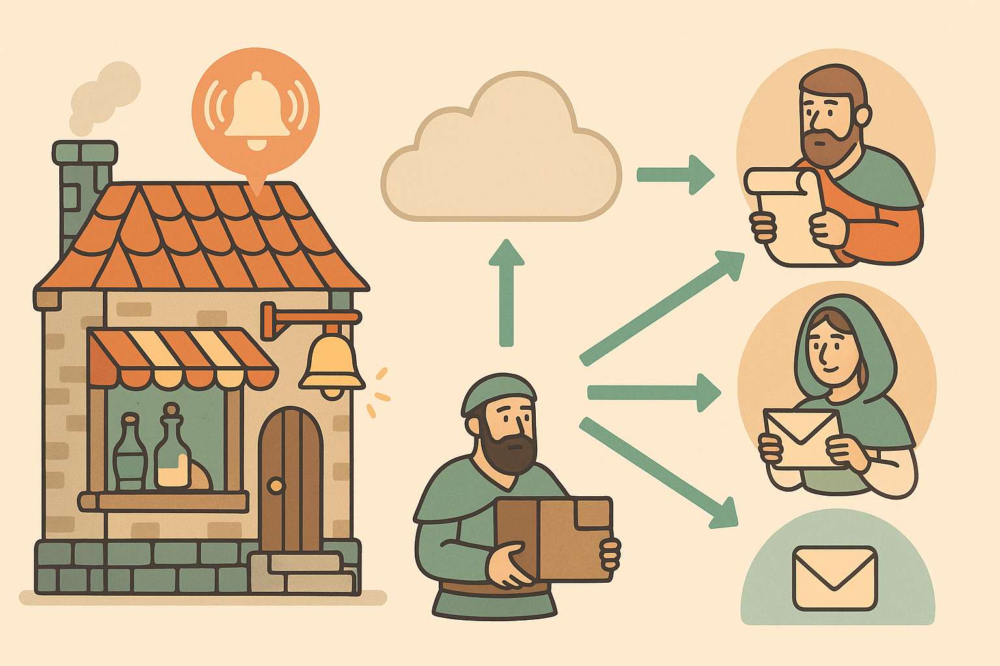

<div dir="rtl">
# EventDrivenFarsi

منبع فارسی برای یادگیری معماری رویداد‌محور و ابزارهای آن به زبان ساده و قابل‌فهم برای انسان‌ها 


# فهرست مطالب

- [معماری Event-Driven چیست؟](#معماری-event-driven-چیست؟)
- [Pub/Sub در یک نگاه](#pubsub-در-یک-نگاه)
- [Apache Kafka برای انسان‌ها](#apache-kafka-برای-انسان‌ها)
  - [Producer و Consumer چیست؟](#producer-و-consumer-چیست؟)
  - [Broker, Topic, Partition](#broker-topic-partition)
  - [Stream Processing چیست؟](#stream-processing-چیست؟)
- [Event Sourcing](#event-sourcing)
- [CQRS](#cqrs)


# معماری Event-Driven چیست؟
مقدمه‌ای بر معماری رویدادمحور (Event-Driven Architectures)
معماری Event-Driven یک الگوی بنیادی برای طراحی ارتباط بین اجزای یک نرم‌افزار است که بر پایه‌ی تبادل asynchronous پیام‌هایی به نام eventها بنا شده است. در این معماری، اجزای مختلف برنامه می‌توانند به صورت پراکنده (distributed) و با اتصال ضعیف (loosely coupled) کنار هم فعالیت کنند   بی‌آنکه مستقیماً به هم وابسته باشند.
احتمالاً شناخته‌شده‌ترین نمونه‌ی این سبک امروزه همان microservices architecture است: جایی که سیستم از چندین سرویس کوچک ساخته شده که از طریق event با هم ارتباط برقرار می‌کنند.
جهان ما از رویدادها ساخته شده؛ آن‌ها همه‌جا هستند. از لحظه‌ای که صبح از خواب بیدار می‌شویم، رویدادی شکل گرفته است. خریدن یک کتاب هم یک رویداد است، چه در پایگاه‌داده‌ای ثبت شده باشد، چه نه. همین که اتفاق افتاده، می‌تواند منجر به چندین واکنش دیگر شود: از ارسال پیام تا صدور فاکتور یا به‌روزرسانی وضعیت سفارش.
همان‌طور که شرکت‌ها در دهه‌ی گذشته به سراغ microservices رفتند تا چالش‌هایی مثل مقیاس‌پذیری وب (web-scale) را حل کنند، امروزه هم علاقه به EDA بیشتر شده تا ما را به سطح مقیاس جهانی (global-scale) برساند.
هدف این فصل آن است که شما را با مفاهیم، اجزا و کاربردهای EDA آشنا کند؛ همان اجزایی که در طول این کتاب، از آن‌ها برای ساختن یک برنامه‌ی نمونه استفاده خواهیم کرد.
همچنین نگاهی خواهیم داشت به مزایای استفاده از این معماری، دلایل انتخاب آن و چالش‌هایی که در مسیر پیاده‌سازی آن   چه در پروژه‌ای کاملاً جدید (greenfield)، چه هنگام افزودن به پروژه‌ای موجود   با آن روبه‌رو خواهید شد.
اگر قصد دارید پروژه‌ای را از ابتدا با دیدگاه event-driven آغاز کنید یا یک نرم‌افزار monolith را به بخش‌های کوچکتر یا حتی microservices تقسیم کنید، این کتاب به شما الگوها و اطلاعات لازم را برای پیاده‌سازی EDA خواهد داد.

## در این فصل به چه موضوعاتی خواهیم پرداخت؟
<br/>

- #### An exchange of facts
- #### The MallBots application
- #### Benefits of EDA
- #### Challenges of EDA

<br/>
<br/>

### تبادل واقعیت‌ها (An exchange of facts)
سه الگوی مختلف وجود دارد که هر کدام به‌تنهایی یا در کنار یکدیگر، معماری Event-Driven را شکل می‌دهند. این سه الگو عبارت‌اند از:

- #### Event notifications
- #### Event-carried state transfer
- #### Event sourcing
در این کتاب، به‌طور جداگانه به هر یک از این الگوها خواهیم پرداخت، موارد استفاده‌ی آن‌ها را بررسی می‌کنیم، و خواهیم دید در چه زمانی استفاده از آن‌ها مفید است و چه زمانی شاید مناسب نباشد.

### ۱. اعلان رویداد (Event notifications)
در این الگو، event‌ها صرفاً به منظور اطلاع‌رسانی منتشر می‌شوند تا به سایر اجزای سیستم اعلام کنند اتفاقی رخ داده است.
این نوع event معمولاً کمترین میزان داده را در خود دارد   گاهی فقط شامل یک شناسه (ID) یا زمان وقوع رویداد است.

اجزایی که این اعلان‌ها را دریافت می‌کنند، آزاد هستند تا تصمیم بگیرند آیا واکنشی نشان دهند یا نه. ممکن است event برای اهداف audit محلی ذخیره شود یا سرویس دریافت‌کننده، با سرویس اصلی تماس بگیرد تا اطلاعات بیشتری درباره‌ی event بگیرد.

**نمونه‌ای از event notification در Go:**

<div dir="ltr">

```go
  type PaymentReceived struct {
    PaymentID string
  }
```
</div>


در اینجا، فقط شناسه‌ی پرداخت منتقل شده است. حالا فرض کنید ServiceA فقط همین اعلان را دریافت می‌کند و کار خاصی انجام نمی‌دهد، در حالی که ServiceB باید اطلاعات بیشتری دریافت کند، پس درخواست دیگری به سرویس پرداخت می‌فرستد.


### ۲. انتقال وضعیت با رویداد (Event-carried state transfer)
این الگو در واقع نسخه‌ی asynchronous از مدل REST است.
برخلاف REST که داده‌ها را هنگام نیاز از سرویس درخواست می‌کنیم (pull)، در اینجا داده‌ها push می‌شوند   یعنی وقتی تغییری رخ داد، آن تغییر به سایر اجزا فرستاده می‌شود.

این کار باعث می‌شود هر سرویس بتواند نسخه‌ی محلی خود از داده را بسازد و دیگر نیازی به ارتباط با سرویس مبدا نداشته باشد.

نمونه‌ای از event-carried state transfer:

<div dir="ltr">

```go
type PaymentReceived struct {
    PaymentID  string
    CustomerID string
    OrderID    string
    Amount     int
}
```
</div>


در اینجا، event شامل جزئیات بیشتری است: مشتری، سفارش و مبلغ پرداخت.
بنابراین، دیگر لازم نیست ServiceB برای دریافت اطلاعات به سرویس پرداخت مراجعه کند؛ همه‌ی آنچه نیاز دارد همین‌جاست.


### ۳. منشأ گرفتن از رویداد (Event sourcing)
در این روش، به‌جای ثبت مستقیم تغییرات در رکوردهای نهایی، همه‌ی تغییرات به‌عنوان یک event ذخیره می‌شوند.
این eventها در یک event store ذخیره شده و می‌توانند بعداً برای بازسازی وضعیت نهایی یک entity استفاده شوند.

یعنی اگر بخواهیم بدانیم وضعیت نهایی یک پرداخت چیست، فقط کافی‌ست همه‌ی eventهای مربوط به آن را بخوانیم و به‌ترتیب آن‌ها را fold کنیم تا به نتیجه‌ی نهایی برسیم.

برخلاف دو الگوی قبلی که eventها را برای ارتباط بین سرویس‌ها می‌فرستند، در event sourcing هدف اصلی نگهداری تغییرات است، نه انتقال آن‌ها.


## اجزای اصلی (Core components)

در قلب همه‌ی الگوهای Event-Driven Architecture، چهار مؤلفه‌ی کلیدی دیده می‌شوند:


در ادامه به‌صورت جداگانه به توضیح هرکدام می‌پردازیم:

## Event
Event همان چیزی‌ست که به خاطرش این معماری شکل گرفته: یک اتفاق واقعی که در سیستم رخ داده و حالا باید اطلاع‌رسانی یا ثبت شود.

در جهان EDA، یک event نماینده‌ی یک حقیقت غیرقابل تغییر (immutable fact) از گذشته است. مثلاً:

یک مشتری در سرویس ما ثبت‌نام کرده
یک پرداخت انجام شده
یا تلاش ناموفقی برای ورود به حساب کاربری صورت گرفته
جالب است که consumerهای این رویداد ممکن است هیچ شناختی از منبع آن نداشته باشند. آن‌ها فقط با خود event کار دارند، نه با تولیدکننده‌ی آن.

در زبان‌هایی مثل Go، معمولاً event‌ها با یک ساختار ساده (struct) نمایش داده می‌شوند. مثلاً:

<div dir="ltr">

```go
type PaymentReceived struct {
    PaymentID string
    OrderID   string
    Amount    int
}
```
</div>
هدف از داشتن event، انتقال اطلاعات کافی برای ثبت یک تغییر در وضعیت سیستم است. این اطلاعات می‌تواند بسته به نوع الگو (notification، state transfer یا sourcing) متفاوت باشد.

## Queue
به Queue ممکن است بسته به تکنولوژی یا کاربرد، نام‌های مختلفی داده شود:
bus، channel، stream، topic و… همگی اصطلاحاتی برای اشاره به چیزی مشابه هستند.
در این متن، از واژه‌ی queue برای اشاره به مکانی استفاده می‌شود که eventها در آن صف می‌گیرند و مصرف می‌شوند. حالا خود queue می‌تواند دو نوع کلی داشته باشد:

#### Message Queues
در این نوع، eventها فقط برای مدت محدودی نگهداری می‌شوند. اگر مصرف نشوند یا زمانشان بگذرد، پاک می‌شوند.
به درد سناریوهایی می‌خورد که subscriber‌ها باید بلافاصله رویداد را دریافت کنند و سیستم ساده‌ای از publish-subscribe کافی است.

مثلاً یک هشدار کوتاه‌مدت برای یک تراکنش بانکی.


#### Event Streams
برخلاف message queue، در اینجا رویدادها نگهداری می‌شوند و می‌توان بارها به آن‌ها دسترسی داشت.
consumerها می‌توانند از ابتدا، از نقطه‌ای خاص، یا از همین حالا شروع به خواندن eventها کنند.

مثلاً برای audit یا تجزیه‌ و تحلیل رفتار کاربران، نیاز داریم همه‌ی رویدادها را نگه داریم و حتی دوباره پخش (replay) کنیم.


#### Event Stores
یک event store چیزی فراتر از یک صف پیام است.
اینجا قرار نیست فقط پیام‌ها ارسال شوند، بلکه تمام تغییرات به‌عنوان یک تاریخچه‌ی دائم (append-only) نگهداری می‌شوند.

در یک event store، میلیون‌ها event stream مختلف می‌تواند وجود داشته باشد. این سیستم معمولاً برای ارتباط بین سرویس‌ها استفاده نمی‌شود، بلکه در کنار event sourcing می‌آید تا وضعیت موجودیت‌ها (entities) را با بازسازی جریان eventها استخراج کنیم.

مثلاً وضعیت نهایی یک سفارش را می‌توان با خواندن همه‌ی رویدادهای مربوط به آن از event store به دست آورد.


#### Producer
هر زمان که تغییری در وضعیت سیستم رخ می‌دهد، producer یک event منتشر می‌کند.
او اطلاعی ندارد که چه کسی قرار است این رویداد را دریافت کند   فقط آن را می‌فرستد، شبیه یک پیام fire-and-forget.

مثلاً سرویسی که وقتی یک سفارش ثبت شد، یک event با اطلاعات سفارش به صف می‌فرستد.

#### Consumer
Consumerها مشترک صف‌ها می‌شوند و eventها را دریافت می‌کنند.
ممکن است به صورت گروهی کار کنند تا بار پردازش بین آن‌ها تقسیم شود یا به صورت مستقل همه‌ی eventها را پردازش کنند.

در حالت stream، می‌توانند از هر نقطه‌ای شروع به خواندن کنند   از ابتدا، از زمان فعلی یا ادامه‌ی آخرین خوانده‌شده.

#### جمع‌بندی (Wrap-up)
تا اینجا، سفری مفهومی در جهان معماری Event-Driven داشتیم. دانستیم که در دنیایی که پر از رویداد است، طراحی سیستم‌هایی که بتوانند با این واقعیت همسو شوند، نه تنها ممکن، بلکه الزامی‌ست.

سه الگوی اصلی   event notification، event-carried state transfer و event sourcing   همچون سه شیوه‌ی روایت یک داستان هستند:
یکی با اشاره‌ای کوتاه، دیگری با جزئیات کامل، و سومی با بازسازی همه‌ی لحظات گذشته.

چه بخواهیم سامانه‌ای را از ابتدا با این نگرش بنا کنیم، یا بخشی از سیستمی موجود را به سوی معماری رویدادمحور هدایت کنیم، باید ابتدا زبان این معماری را بفهمیم:
زبان eventها، queueها، producerها و consumerها.

اکنون که با اجزای بنیادین این معماری آشنا شدیم، می‌توانیم در ادامه، به بررسی نحوه‌ی بهره‌برداری عملی از آن‌ها بپردازیم   از مزایا و انعطاف‌پذیری گرفته تا چالش‌هایی که ناگزیر در مسیر خواهیم دید.

EDA فقط یک تکنولوژی نیست، بلکه یک طرز فکر است:
نگاهی به سامانه‌ها نه به‌عنوان یک سازه‌ی ایستا، بلکه به‌مثابه جریانی زنده از رویدادها که هر لحظه در حال دگرگونی‌اند.


## مزایای معماری - Benefits of EDA 

معماری Event-Driven در مقایسه با معماری‌های مبتنی بر ارتباطات synchronous یا point-to-point (P2P) مزایای متعددی به همراه دارد. در این بخش، مهم‌ترین آن‌ها را مرور می‌کنیم:

###  پایداری و تاب‌آوری (Resiliency)
در معماری P2P، یک کامپوننت (مثلاً سرویس Orders) برای عملکرد صحیح خود وابسته به در دسترس بودن سرویس مقصد (مثلاً Depot) است.
اگر سرویس مقصد به‌موقع پاسخ ندهد یا دچار خطا شود، این اشکال به مبدأ برمی‌گردد و در زنجیره‌ای از وابستگی‌ها ممکن است کل عملیات شکست بخورد.


در مقابل، در معماری Event-Driven، اجزا به‌صورت loosely coupled طراحی می‌شوند و ارتباط آن‌ها از طریق یک event broker صورت می‌گیرد.
در این مدل، اگر یک consumer دچار مشکل شود یا حتی کرش کند، تأثیری بر producer نخواهد داشت. پردازش فقط با تأخیر مواجه می‌شود، نه با شکست.

حتی اگر سرویس Depot به طور کامل غیرفعال شود، سیستم همچنان می‌تواند سفارش‌ها را دریافت کند و پس از بازیابی Depot، پردازش آن‌ها را ادامه دهد.
این یعنی پایداری سیستم در برابر خطاها یا افزایش فشار کاری، به‌مراتب بیشتر است.


###  چابکی در توسعه (Agility)
یکی دیگر از مزایای کلیدی Event-Driven، امکان توسعه‌ی چابک‌تر است.

در این معماری، تیم‌های مختلف می‌توانند بدون نیاز به هماهنگی زیاد با سایر تیم‌ها، کامپوننت جدیدی را به سیستم اضافه کنند.
برای مثال، یک تیم کوچک می‌تواند سرویسی جدید را تنها با اتصال به event stream راه‌اندازی کرده و به داده‌های مورد نیاز خود دسترسی داشته باشد   بدون اینکه نیاز باشد سایر سرویس‌ها را تغییر دهند یا API جدید تعریف کنند.


حتی اگر نیاز به حذف این سرویس باشد، این کار بدون اختلال در اجزای دیگر انجام‌پذیر است.
این قابلیت، به سازمان اجازه می‌دهد تا با سرعت بیشتر آزمایش کند، توسعه دهد و تصمیم بگیرد.


###  تجربه‌ی کاربری بهتر (User Experience)
در دنیای امروزی با رشد IoT و تلفن‌های همراه، کاربران انتظار دارند به‌محض وقوع یک رویداد   مثل ثبت سفارش یا تغییر وضعیت حمل   مطلع شوند.

معماری Event-Driven، به‌طور ذاتی بر پایه‌ی ارسال notification ساخته شده و آمادگی دارد تا همین پیام‌ها را مستقیماً به کاربران نیز منتقل کند.
این موضوع در بهبود رضایت کاربر و پاسخ‌دهی سریع‌تر سیستم مؤثر است، چیزی که در معماری‌های سنتی synchronous-first بسیار دشوارتر خواهد بود.

###  تحلیل‌پذیری و نظارت (Analytics and Auditing)
هر سه الگوی اصلی در Event-Driven   شامل event notification، event-carried state transfer و event sourcing   امکان نظارت دقیق بر ریزترین تغییرات سیستم را فراهم می‌کنند.

همچنین، داده‌های ایجادشده در این مدل، پایه‌ای مناسب برای توسعه‌ی ماژول‌های analytics و استخراج بینش‌های تجاری (Business Intelligence یا BI) فراهم می‌کند.
در معماری‌های سنتی، معمولاً داده‌های کافی برای تحلیل رفتار کاربران یا روندهای بازار وجود ندارد یا تنها می‌توان تصویر ناقصی از گذشته را بازسازی کرد.


## چالش‌های معماری Event-Driven (Challenges of EDA)

پیاده‌سازی الگوهای Event-Driven در یک برنامه، علاوه بر مزایای متعدد، با چالش‌هایی نیز همراه است که برای موفقیت پروژه، باید به آن‌ها توجه و راه‌حل‌هایی برایشان تعریف کرد.

###  همگرایی نهایی (Eventual Consistency)
در هر برنامه‌ی توزیع‌شده، eventual consistency یک چالش ذاتی است.
تغییراتی که در وضعیت سیستم رخ می‌دهند، ممکن است بلافاصله در همه‌جا در دسترس نباشند. در نتیجه، کوئری‌ها ممکن است موقتاً داده‌هایی منسوخ‌شده (stale) بازگردانند، تا زمانی که تمام تغییرات به‌طور کامل پردازش و ثبت شوند.

در هر معماری asynchronous، این مسئله وجود دارد؛ اما در EDA، این واقعیت اجتناب‌ناپذیر است.

### نوشتن دوگانه (Dual Writes)
چالش dual write، صرفاً محدود به EDA نیست، اما در آن بارزتر می‌شود.
وقتی در طول یک عملیات، وضعیت برنامه در بیش از یک محل تغییر می‌کند (مثلاً هم در پایگاه داده، هم در ارسال یک event)، احتمال ناسازگاری افزایش می‌یابد.

در EDA، معمولاً داده‌ها در دیتابیس ثبت می‌شوند و همزمان یک event تولید و به event broker فرستاده می‌شود. اگر ارسال event با خطا مواجه شود، سیستم دچار ناهماهنگی می‌شود: داده در پایگاه داده هست، ولی event مربوطه هیچ‌وقت به بقیه‌ی اجزا نمی‌رسد.

راه‌حل این مشکل استفاده از Outbox pattern است: ثبت event مورد نظر به‌عنوان یک رکورد در کنار سایر تغییرات دیتابیس (در همان تراکنش)، تا حالت atomicity حفظ شود.
در مراحل بعد، این event از Outbox خوانده شده و به صورت ایمن به broker منتشر می‌شود.

توضیحات بیشتر درباره‌ی این الگو در فصل های آینده (Asynchronous Connections) مطالب بیشتر ارائه خواهد شد.
۳. فرایندهای توزیع‌شده و غیربلادرنگ (Distributed and Asynchronous Workflows)
در یک معماری Event-Driven، فرایندها اغلب به‌صورت workflow بین چندین کامپوننت مستقل اجرا می‌شوند و تماماً asynchronous هستند.


این سبک اجرا منجر به eventual consistency می‌شود، چراکه هیچ کامپوننتی به‌تنهایی وضعیت نهایی کل سیستم را در اختیار ندارد. این موضوع دو چالش به همراه دارد:

### تجربه‌ی کاربری (UX)

ماهیت asynchronous باعث می‌شود نتوان به کاربر پاسخ بی‌درنگ داد. برای حل این مشکل می‌توان از:

polling در سمت client
WebSocket برای پاسخ غیربلادرنگ
یا آموزش کاربر برای "بازگشت در آینده" و مشاهده‌ی نتیجه
استفاده کرد.

### هماهنگی بین اجزا (Component Collaboration)

برای اجرای workflowهای پیچیده بین اجزا، معمولاً یکی از دو الگوی زیر استفاده می‌شود:


- #### Choreography: هر کامپوننت از نقش خود و مرحله‌ی بعدی آگاه است.
- #### Orchestration: یک orchestrator مرکزی، وظیفه‌ی هماهنگ‌سازی همه‌ی مراحل را بر عهده دارد، و اجزا فقط کار خود را انجام می‌دهند.
این موضوع به‌صورت کامل در فصل های بعد (Message Workflows) بررسی خواهد شد.

###  اشکال‌زدایی و ردیابی (Debuggability)
در معماری P2P یا synchronous، همیشه می‌دانیم چه کسی چه چیزی را فراخوانی کرده.
مثلاً می‌توان یک request ID یکتا از ابتدا تا انتهای زنجیره‌ی درخواست دنبال کرد.

اما در EDA، ممکن است یک event منتشر شود بدون اینکه دقیقاً بدانیم چه کسی آن را مصرف می‌کند یا چه عملیاتی در پاسخ به آن اجرا می‌شود.
همچنین، ممکن است یک event باعث چندین عملیات مختلف و غیرمرتبط شود که بازگشت به منشأ اولیه را دشوار می‌کند.

راه‌حل این چالش، توسعه‌ی همان راه‌حل‌های tracing است که در معماری‌های P2P استفاده می‌شود با اعمال تکنیک‌های جدید.
در این‌باره در فصل های بعد (Monitoring and Observability) بیشتر صحبت خواهیم کرد.

###  درست فکر کردن (Getting It Right)
درک صحیح EDA به تفکری متفاوت نیاز دارد. تیم‌ها باید برنامه را از منظر رفتارها و رویدادها تحلیل کنند، نه فقط عملیات و APIها.

این یعنی دیدن تغییرات ریز اما مهمی که ارزش event شدن دارند، و برنامه‌ریزی برای آن‌ها.

در های بعد (Supporting Patterns in Brief) و (Design and Planning) ابزارهایی معرفی می‌شوند که به تیم‌ها برای طراحی دقیق‌تر و قابل نگهداری‌تر کمک می‌کنند.
۶. خطر تبدیل سیستم به Big Ball of Mud
حتی با استفاده از event هم می‌توان دچار Big Ball of Mud (BBoM) شد یعنی سیستمی بی‌ساختار و در‌هم.
اگر رفتارها و رویدادها به‌درستی تفکیک و شناسایی نشوند، نتیجه چیزی جز آشوب توزیع‌شده نخواهد بود.

<br/>
<br/>
<br/>
<br/>
<br/>
<br/>


## الگوهای پشتیبان به‌اختصار (Supporting Patterns in Brief)

الگوهای نرم‌افزاری زیادی وجود دارند که ممکن است در توسعه‌ی یک برنامه‌ی event-driven از آن‌ها استفاده کنیم یا با آن‌ها مواجه شویم.
معماری Event-Driven نباید اولین ابزاری باشد که در جعبه‌ابزار خود به سراغش می‌روید.

ما قبلاً با معماری‌های event-driven آشنا شده‌ایم، و حالا الگوهایی را خواهیم دید که در کنار EDA به طراحی و توسعه‌ی برنامه‌هایی با کیفیت بالا کمک می‌کنند.
این الگوهای مفید ممکن است همیشه موفق نباشند، اما استفاده از آن‌ها در مکان‌های درست و به‌صورت متعادل، زمان تولید را کاهش داده و نرخ خطاها را پایین می‌آورد.

در این فصل، به موضوعات اصلی زیر خواهیم پرداخت:

- Domain-driven design
- Domain-centric architectures
- Command and Query Responsibility Segregation
- Application architectures 

### طراحی دامنه‌محور (Domain-driven design)

طراحی دامنه‌محور (DDD) موضوعی بسیار گسترده و پیچیده است که کتاب‌های کاملی به استفاده و پیاده‌سازی الگوها و روش‌شناسی‌های مختلف آن اختصاص داده شده است.
در این فصل نمی‌خواهیم همه‌ی آن را توضیح دهیم، چه برسد به این بخش، بلکه نگاهی سطح‌بالا به الگوهای استراتژیک کلیدی خواهیم داشت که هنگام طراحی و توسعه‌ی برنامه‌های event-driven برای ما مفید هستند.

در مورد الگوهای تاکتیکی، در ادامه‌ مثال‌هایی از کاربرد آن‌ها را خواهیم دید.

### برداشت‌های نادرست درباره‌ی DDD
فلسفه‌ها، متدولوژی‌ها و الگوهای DDD برای توسعه‌ی برنامه‌های event-driven بسیار مناسب هستند.
قبل از پرداختن به DDD، می‌خواهم چند برداشت نادرست را که ممکن است توسعه‌دهندگان داشته باشند، مطرح کنم:

#### برداشت نادرست اول – DDD مجموعه‌ای از الگوهای کدنویسی است

برای بسیاری از توسعه‌دهندگان، اولین مواجهه با DDD ممکن است در قالب مشاهده‌ی یک entity، value object یا الگویی مثل repository در یک کدبیس باشد، یا از طریق یک آموزش وب که یکی دو الگو را توضیح می‌دهد.
اما صرف‌نظر از تعداد الگوهایی که دیده می‌شوند، این تصویر کاملی از DDD نیست.
بخش بزرگی از DDD هرگز به‌طور مستقیم در کد دیده نمی‌شود، و مقدار زیادی از DDD پیش از نوشتن حتی یک خط کد وارد فرایند می‌شود.

#### برداشت نادرست دوم – DDD مختص برنامه‌های سازمانی است یا منجر به طراحی بیش‌ازحد می‌شود

DDD هیچ معماری خاصی را تجویز نمی‌کند و به شما نمی‌گوید که چطور کدتان را در یک زبان برنامه‌نویسی خاص سازمان‌دهی کنید یا الزامی برای استفاده از یک ساختار خاص ندارد.
DDD شما یا تیمتان را مجبور به استفاده از یک معماری یا الگوی خاص نمی‌کند این چیزی‌ست که شما انجام می‌دهید.
الگوهای استراتژیک DDD در واقع به شما کمک می‌کنند تا بخش‌هایی از دامنه‌ی مسئله را شناسایی کنید که نیازی به صرف زمان و منابع زیاد توسعه ندارند.

هر دو برداشت نادرست، حول استفاده و برداشت نادرست از الگوهای تاکتیکی DDD می‌چرخند.
ما به‌عنوان توسعه‌دهندگان، افرادی با ذهنیت فنی هستیم؛ در مواجهه با یک مسئله‌ی جدید یا چالش‌برانگیز، به‌دنبال یک راه‌حل فنی یا راه بهتری برای انجام آن می‌گردیم.
چیزی که یاد گرفته‌ایم یا استفاده کرده‌ایم، وارد مکالمات ما می‌شود مخصوصاً زمانی که اسم الگوها را می‌آوریم.

اگر تنها چیزی که می‌جوییم یا به اشتراک می‌گذاریم، الگوهای تاکتیکی DDD باشد، ناگزیر بخش طراحی و الگوهای استراتژیک را از دست می‌دهیم و بعد از آن، ممکن است گلایه کنیم که DDD یک پروژه‌ی دیگر را هم نابود کرده است.

### پس واقعاً موضوع چیست؟
DDD درباره‌ی مدل‌سازی یک ایده‌ی تجاری پیچیده در قالب نرم‌افزار است از طریق توسعه‌ی یک درک عمیق از دامنه‌ی مسئله.
این درک سپس برای شکستن مسئله به بخش‌های کوچکتر و قابل‌مدیریت‌تر استفاده می‌شود.

دو الگوی کلیدی DDD که در اینجا نقش دارند:

Ubiquitous Language
Bounded Contexts
#### هم‌راستایی و توافق بر سر اهداف
برای موفقیت در DDD، باید همکاری میان کارشناسان دامنه (domain experts) و توسعه‌دهندگان وجود داشته باشد.
باید جلساتی برگزار شود که در آن مفاهیم و ایده‌های تجاری ترسیم و نمودار شوند، از بالا تا پایین بررسی شوند و به‌طور کامل مورد بحث قرار گیرند.
نتایج این گفت‌وگوها سپس مدل‌سازی می‌شوند و دوباره بررسی می‌شوند تا برداشت‌های نادرست از جزئیات ضمنی، شناسایی و حذف شوند.

این یک فرایند یک‌باره قبل از شروع کدنویسی نیست.
سیستم‌های پیچیده موجودیت‌هایی زنده هستند آن‌ها تغییر می‌کنند و تکامل می‌یابند.
وقتی ویژگی‌های جدیدی در حال بررسی هستند، همان افراد باید دوباره جلسه داشته باشند تا این تغییرات را در مدل دامنه وارد کنند.

#### صحبت به یک زبان مشترک
وقتی کارشناسان دامنه با توسعه‌دهندگان به گفت‌وگو می‌نشینند، ممکن است مکالمات به بن‌بست برسد اگر دو طرف نتوانند درک مشترکی از مفاهیم داشته باشند.

اصل Ubiquitous Language (UL) ایجاب می‌کند که هر اصطلاح دامنه‌ای، تنها یک معنی مشخص در یک Bounded Context داشته باشد.

با استفاده از یک زبان مشترک، درک عمیق‌تری از دامنه شکل می‌گیرد.
کارشناسان دامنه زبان تخصصی خودشان را دارند و توسعه‌دهندگان هم همین‌طور.
ترجیح داده می‌شود از اصطلاحاتی استفاده شود که کارشناسان دامنه بیان می‌کنند و این اصطلاحات باید برای نام‌گذاری و توصیف مدل‌های دامنه به کار بروند.

این اصل، هسته‌ی DDD است و یکی از مهم‌ترین اصول نیز هست، اما دستیابی به آن آسان نیست.
کلماتی که باید ساده و واضح باشند، ممکن است ناگهان معنای خود را از دست بدهند.
کلمات عمق پیدا می‌کنند که این خودش نشانه‌ای‌ست برای همه‌ی افراد درگیر، که توسعه‌ی یک UL و استفاده‌ی دائم از آن، چقدر حیاتی‌ست.

برای تأکید بیشتر، از UL در همه‌جا استفاده کنید:
در کد، در نام توابع، در ساختارها (structs)، در متغیرها و در فرایندهایی که توسعه می‌دهید.

زمانی که وظیفه‌ای را نهایی می‌کنید یا باگ جدیدی را بررسی می‌کنید، UL باید مبنای درک مشترک باشد. این کار باعث می‌شود UL در سراسر سازمان هم‌راستا باقی بماند.

وقتی UL صحبت می‌شود ولی ابهام به وجود می‌آید، ممکن است نشانه‌ای باشد از اینکه مدل دامنه در حال تکامل است و زمان آن رسیده که جلسه‌ی جدیدی با domain expertها و توسعه‌دهندگان برگزار شود.

### مقابله با پیچیدگی
پیچیدگی دامنه را می‌توان با شکستن آن به زیر-دامنه‌ها (subdomains) کاهش داد تا بتوان مسئله را به بخش‌های کوچک‌تر و قابل‌مدیریت‌تر تبدیل کرد.

هر دامنه‌ای که شناسایی می‌کنیم، به یکی از سه نوع زیر تعلق دارد:

- Core domains: مؤلفه‌های حیاتی برنامه که منحصربه‌فرد هستند یا مزیت رقابتی برای کسب‌وکار ایجاد می‌کنند.
این بخش‌ها بیشترین تمرکز، منابع و توسعه‌دهندگان را به خود اختصاص می‌دهند.
دامنه‌ی هسته‌ای همیشه بدیهی نیست و ممکن است با تغییرات کسب‌وکار، تکامل یا تغییر کند.
- Supporting domains: مؤلفه‌هایی که عملکردهایی در جهت پشتیبانی از هسته‌ی کسب‌وکار ارائه می‌دهند.
اگر این عملکرد خاص کسب‌وکار نیست، بهتر است از راه‌حل‌های آماده استفاده شود.
- Generic domains: مؤلفه‌هایی که مستقیماً با هسته‌ی کسب‌وکار مرتبط نیستند اما برای عملکرد آن ضروری‌اند.
مثل ایمیل، پردازش پرداخت، گزارش‌گیری و دیگر راه‌حل‌های عمومی.
برای این بخش‌ها معمولاً منطقی نیست که تیم توسعه‌ی جداگانه‌ای اختصاص داده شود، وقتی راه‌حل‌های آماده‌ی زیادی وجود دارد.
با تغییرات در پاسخ به رقابت یا عوامل دیگر، ممکن است در گذر زمان، نوع یک دامنه تغییر کند یا آن دامنه به دو یا چند دامنه‌ی جدید تقسیم شود.


### مدل‌سازی (Modeling)

مدل دامنه حاصل همکاری بین متخصصان دامنه (domain experts) و توسعه‌دهندگان با استفاده از Ubiquitous Language (UL) است.
آنچه وارد مدل می‌شود، باید محدود به داده‌ها و رفتارهایی باشد که به دامنه‌ی مسئله مربوط هستند نه تلاش برای شبیه‌سازی تمام واقعیت.
هدف از مدل دامنه، حل مسائلی است که در دامنه شناسایی شده‌اند.

اریک اِوانز پیشنهاد می‌کند که با چند مدل مختلف آزمایش کنید و روی جزئیات بیش از حد متوقف نشوید.
شما باید آنچه را که در مکالمه با متخصصان دامنه مهم است، استخراج کنید:
به کلمات رابط برای شناسایی فرآیندها و رفتارها گوش دهید، به عناوین و موقعیت‌ها برای شناسایی نقش‌ها، و البته به نام اشیاء برای شناسایی داده‌ها.
این‌ها باید روی یک سطح بزرگ مثل تخته‌سفید، کاغذ طوماری یا دیوار خالی (اگر از EventStorming استفاده می‌کنید) ثبت شوند.
در فصل سوم (Design and Planning) درباره‌ی استفاده از EventStorming برای توسعه‌ی مدل دامنه بیشتر صحبت خواهیم کرد.

مدل نباید درگیر پیچیدگی‌های فنی یا نگرانی‌های پیاده‌سازی مثل دیتابیس یا روش‌های ارتباط بین‌پردازشی باشد؛ تمرکز باید فقط روی دامنه‌ی مسئله باقی بماند.

### تعریف مرزها (Defining boundaries)

هر مدل متعلق به یک bounded context است، که خود یک مؤلفه از برنامه است.
از آنجا که مدل متعلق به این context است، باید مراقب بود که از نفوذهای بیرونی محافظت شود یا کنترل خارجی بر آن تحمیل نشود.

شما با شکستن پیچیدگی به چندین دامنه و کشف مدل‌های نهفته در نرم‌افزارتان، در حال پیش‌روی هستید.
مرزهایی که از دل این کشف‌ها به‌وجود می‌آیند، حول محور business capabilities در برنامه شما شکل می‌گیرند.

برای مثال، قابلیت‌های کسب‌و‌کاری در یک برنامه مانند MallBots عبارت‌اند از:

- مدیریت سفارش‌ها (Order management)
- پردازش پرداخت (Payment processing)
- عملیات انبار (Depot operations)
- مدیریت موجودی فروشگاه (Store inventory management)
هیچ‌کدام از این دامنه‌ها نباید نگاه واحدی به یک مدل داشته باشند؛
بلکه هر کدام باید تنها درگیر بخش‌هایی از مدل باشند که در context خودشان معنا دارد.

هر bounded context زبان خاص خودش (UL) را دارد.
یعنی ممکن است یک واژه در contextهای مختلف، معنای متفاوتی داشته باشد.

محصولاتی که مشتری انتخاب می‌کند، ممکن است در چندین دامنه وجود داشته باشند؛ اما بسته به context، مدل‌های آن‌ها کاملاً متفاوت، با اهداف و ویژگی‌های متفاوت خواهند بود.

وقتی کارشناسان دامنه و توسعه‌دهندگان درباره‌ی «محصول» صحبت می‌کنند، باید context مورد اشاره را مشخص کنند:
آیا منظورشان موجودی انبار فروشگاه است؟
آیا درباره‌ی اقلام موجود در یک سفارش صحبت می‌کنند؟
یا تحویل و ارسال آن در انبار (depot) را مد نظر دارند؟

bounded context به لحاظ فنی هم جلوه‌ای دارد:
در یک برنامه‌ی توزیع‌شده، معمولاً به شکل یک ماژول یا یک microservice پیاده‌سازی می‌شود ولی نه همیشه.
یک مرز مشخص وجود دارد که دستکاری (mutation) و کوئری‌های مربوط به مدل در آن context محدود باقی می‌ماند.

bounded contextها مفهومی دشوار هستند
برای اجرای خوب DDD، باید مفهوم bounded context را درک کرد.
توصیه می‌کنم یکی از کتاب‌های پیشنهادی را مطالعه کرده یا درباره‌ی این مفهوم جست‌وجو کنید.
یافتن یا تعریف مرزهای مناسب در یک برنامه، یک علم نیست بلکه بیشتر یک هنر است.

### بازگشت به یکپارچگی (Tying it back together)

ممکن است به‌نظر متناقض برسد که این‌همه تلاش برای شکستن دامنه به زیر-دامنه‌ها و bounded contextها انجام می‌شود، اما در نهایت باید دوباره طراحی شود که چطور این‌ها با هم کار کنند و یکپارچه شوند.

اینجاست که از context mapping استفاده می‌کنیم تا روابط بین مدل‌ها و contextهایی را که برای عملکرد برنامه نیاز داریم، ترسیم کنیم.

هدف context mapping، شناسایی روابط بین مدل‌ها و همچنین تیم‌های دخیل در آن contextهاست.
الگوهایی که در context mapping استفاده می‌شوند، فقط توصیفی هستند هیچ‌گونه راهنمایی درباره‌ی پیاده‌سازی فنی اتصال بین مدل‌ها ارائه نمی‌دهند:

#### - الگوهای Upstream:
  - Open host service: این context یک قرارداد مشخص در اختیار downstream contextها قرار می‌دهد تا به آن متصل شوند.
  - Event publisher: این context، eventهایی را برای ادغام منتشر می‌کند که سایر contextها می‌توانند آن‌ها را subscribe کنند.
#### - الگوهای Midway:
- Shared kernel: دو تیم زیرمجموعه‌ای مشترک از مدل دامنه (و شاید دیتابیس) را به اشتراک می‌گذارند.
- Published language: یک زبان مستند مشترک که برای ترجمه‌ی مدل‌ها بین contextها استفاده می‌شود. اغلب با open host service ترکیب می‌شود.
- Separate ways: contextهایی که به‌خاطر هزینه‌ی بالای ادغام، هیچ ارتباطی با هم ندارند.
Partnership: رابطه‌ای مشارکتی بین دو context با مدیریت مشترک بر ادغام بین آن‌ها.
#### - الگوهای Downstream:
- Customer/supplier: رابطه‌ای که در آن downstream می‌تواند تغییرات در upstream را وتو یا مذاکره کند.
- Conformist: سرویس downstream به مدل context بالادستی (upstream) وابسته است.
- Anticorruption layer: لایه‌ای که سرویس downstream را از تغییرات در مدل upstream ایزوله می‌کند.
با استفاده از الگوهای بالا، می‌توانیم روابط بین contextهای مختلف برنامه را مشخص کنیم.

### این‌ها چه کاربردی برای EDA دارند؟ (How is it useful for EDA?)

DDD به‌طور کلی برای برنامه‌های event-driven مفید است اگرچه بدون آن هم ممکن است به خوبی کار کنید.
اما چیزی که DDD وارد بازی می‌کند یعنی بررسی دقیق مسئله‌ی تجاری با کمک domain expertها، و توسعه‌ی UL برای شکستن پیچیدگی به bounded contextها قابل چشم‌پوشی نیست.

برنامه‌های event-driven با تلاش برای نام‌گذاری بهتر eventها،
تشخیص eventهای مربوط به یکپارچگی (integration events)،
و تبدیل آن‌ها به بخشی از قرارداد یک bounded context، قطعاً منتفع خواهند شد.

### معماری‌های دامنه‌محور (Domain-centric architectures)

معماری دامنه‌محور، همان‌طور که پیش‌تر هم اشاره شد، معماری‌ای‌ست که دامنه را در مرکز خود قرار می‌دهد.
در اطراف دامنه، لایه‌ای برای منطق کاربرد (application logic) قرار دارد، و بیرون از آن، لایه‌ای برای زیرساخت یا دغدغه‌های بیرونی.

هدف این معماری، حفظ دامنه از تأثیرات خارجی مانند جزئیات دیتابیس یا وابستگی به فریمورک‌هاست.

قبل از اینکه بیشتر درباره‌ی معماری دامنه‌محور صحبت کنیم، ابتدا نگاهی خواهیم داشت به برخی معماری‌های سنتی یا سازمانی (enterprise).


### مشکل معماری‌های سنتی

تیم‌ها در طول زمان متوجه خواهند شد که در معماری‌های سنتی، هزینه‌ی نگهداری برنامه به‌مرور افزایش می‌یابد.
این معماری‌ها همچنین هنگام تغییر زیرساخت‌ها یا نیازمندی‌های فنی، به‌سختی قابل به‌روزرسانی هستند.
در هر دو معماری نشان‌داده‌شده در برنامه‌ها به لایه‌هایی تقسیم شده‌اند و از نظر مفهومی تفاوت زیادی با هم ندارند.
مشکل، خودِ لایه‌ها نیست بلکه شیوه‌ی coupling (وابستگی تنگاتنگ) میان آن‌هاست.
مدل‌های داده‌ای که در لایه‌ی data access قرار دارند، در لایه‌های application و presentation نیز استفاده می‌شوند.
برعکس آن نیز ممکن است: مدل‌های درخواست (request models) که در UI frameworkها استفاده می‌شوند، وارد سایر لایه‌ها می‌شوند.
نتیجه‌ی این وابستگی‌ها این است که اگر تغییری در لایه‌ی presentation ایجاد شود، به احتمال زیاد باید در data access هم تغییراتی اعمال کرد.
درگیر شدن با این شبکه‌ی درهم‌تنیده از وابستگی‌ها و coupling شدید، باعث می‌شود که هزینه‌های سازمان برای نگهداری برنامه در طول زمان به‌سرعت افزایش یابد.

### یک راه‌حل در حال تکامل (An evolving solution)

Alistair Cockburn در سال ۲۰۰۵ با معرفی hexagonal architecture (در حین توضیح الگوی ports and adapters) راه‌حلی برای مشکل coupling درون یک برنامه پیشنهاد داد:
https://alistair.cockburn.us/hexagonal-architecture
در این معماری، برنامه به دو بخش تقسیم می‌شود:


بخش درونی برنامه (core)
بخش بیرونی شامل وابستگی‌ها
هر وابستگی خارجی به دو جزء تقسیم می‌شود:

یک port یا interface
و یک adapter یا پیاده‌سازی (implementation)
برای مثال، interface‌ای به نام PeopleRepository در تصویر نقش port را دارد،
و دو پیاده‌سازی مختلف به نام‌های RedisPeopleRepository و TestPeopleRepository نقش adapter را ایفا می‌کنند.

با استفاده از این تکنیک، برنامه‌های ما از تغییرات در وابستگی‌های بیرونی ایزوله می‌شوند.


### Onion architecture 
در سال ۲۰۰۸، Jeffrey Palermo ما را با onion architecture آشنا کرد:
https://jeffreypalermo.com/2008/07/the-onion-architecture-part-1/
در این معماری، dependency inversion principle نقش بسیار مهمی دارد (که در بخش‌های بعدی بیشتر توضیح داده خواهد شد).


یک برنامه با معماری hexagonal اکنون به لایه‌های مختلف تقسیم شده است:

- application services
- domain services
- domain model

وابستگی‌های بیرونی، خارجی‌ترین لایه را در اطراف هسته‌ی برنامه تشکیل می‌دهند.
تمام وابستگی‌ها به سمت درون و به‌سمت مدل دامنه اشاره می‌کنند،
و دایره‌های بیرونی، پیاده‌سازی‌های interface های قرار‌گرفته در لایه‌های داخلی را در خود جای می‌دهند.

Palermo همچنین پیشنهاد کرد که از یک inversion of control container برای مدیریت تزریق وابستگی‌ها (dependency injection) استفاده شود.
زبان Go پشتیبانی قوی‌ای برای DI ندارد، اما در فصل چهارم (Event Foundations) راه‌حل‌هایی در این‌باره خواهیم دید.


### Clean Architecture
در سال ۲۰۱۲، Robert C. Martin (عمو باب)، پس از بررسی معماری‌های hexagonal و onion و چند مدل دیگر،
معماری Clean Architecture را معرفی کرد:
https://blog.cleancoder.com/uncle-bob/2012/08/13/the-clean-architecture.html

#### شباهت‌های معماری‌های موفق
او اشاره کرد که این معماری‌ها چند ویژگی مشترک دارند:

- به هیچ فریمورکی وابسته نیستند که بخواهند برنامه را بر پایه‌ی آن scaffold کنند
- طراحی آن‌ها به تولید کدی testable کمک می‌کند
- زیرساخت‌ها به‌عنوان وابستگی‌های قابل جایگزینی در نظر گرفته می‌شوند


## قانون وابستگی مارتین (Martin’s Dependency Rule)
مهم‌ترین اصل در معماری‌های domain-centric، به‌گفته‌ی مارتین، این است:

«وابستگی‌های سورس‌کد تنها باید به سمت درون اشاره داشته باشند.»
هیچ‌چیزی در یک دایره‌ی درونی، نباید به چیزی در دایره‌ی بیرونی ارجاع دهد.
برنامه باید ارجاعات را تنها با استفاده از اصل dependency inversion حل کند.


اگر از درونی‌ترین لایه‌ها شروع کنیم ، موارد زیر را خواهیم داشت:

مدل و interface هایی مانند IRepository
که فقط می‌توانند به سایر entity ها در لایه‌ی Entities ارجاع دهند، و نه بیشتر.
سپس لایه‌ی Use Cases با component هایی مانند Application و IApplication
که فقط مجاز به استفاده از آیتم‌های موجود در Use Cases یا Entities هستند.
در لایه‌ی Interface Adapters، کنترلرها و پیاده‌سازی‌های repository ها قرار دارند.
در نهایت، آخرین لایه ممکن است ظاهراً شامل یک خطا باشد:
فلش ارجاع از repository به سمت دیتابیس قرار دارد، در حالی که طبق اصل Dependency Inversion Principle (DIP) نباید این‌طور باشد.

در واقع، پیاده‌سازی واقعی repository حتماً باید ارجاعی به دیتابیس داشته باشد تا کار کند،
اما interface IRepository باعث می‌شود کل برنامه از پیاده‌سازی خاص دیتابیس ایزوله بماند.


## به‌کارگیری معماری شش‌ضلعی (Hexagonal architecture applied)

Alistair Cockburn معماری hexagonal را برای مقابله با نفوذ منطق تجاری به بخش‌هایی از نرم‌افزار که ارتباطی با آن ندارند، ابداع کرد.
او سه عامل اصلی برای این مشکل برشمرد:

- تست‌نویسی دشوار می‌شود وقتی تست‌ها وابسته به رابط کاربری (UI) باشند
- coupling (وابستگی تنگاتنگ) جابه‌جایی بین استفاده‌ی انسانی و ماشینی را غیرممکن می‌کند
- تغییر یا تعویض زیرساخت‌ها هنگام نیاز یا فرصت، بسیار دشوار یا حتی غیرممکن می‌شود

### راه‌حل چه بود؟
جداسازی کامل application core از وابستگی‌های خارجی.
Cockburn پیشنهاد داد که APIها (ports) در مرز برنامه تعریف شوند و برای تعامل با اجزای خارجی، از adapters استفاده شود.
این جفت شدن abstraction و پیاده‌سازی concrete باعث می‌شود که اجزای خارجی مثل UI جدید، تست هارنس با mock، یا زیرساخت متفاوت بتوانند به‌راحتی جایگزین یا افزوده شوند.


ترکیب با Clean Architecture
در نمودارهای اولیه‌ی معماری hexagonal، به دامنه به‌اندازه‌ی کافی توجه نشده بود.
 نویسنده یک دامنه را به برنامه اضافه کرده و hexagonی برای UI و زیرساخت طراحی کرده تا تفسیری ترکیبی از این دو معماری ارائه دهد

### لایه دامنه (Domain)
در مرکز نمودار، دامنه قرار دارد لایه‌ای شامل:
مدل دامنه
منطق خاص دامنه
و سرویس‌های دامنه
این لایه، کمترین تأثیر را از تغییرات بیرونی می‌پذیرد.
هیچ وابستگی خارجی ندارد و هیچ ارجاعی به اجزای بیرونی یا application serviceها در آن دیده نمی‌شود.


### لایه برنامه (Application)
اطراف دامنه، لایه‌ی application قرار دارد جایی که منطق خاص برنامه و سرویس‌های آن تعریف می‌شود.
همچنین، interfaceهایی که اجزای خارجی از آن برای تعامل با برنامه استفاده می‌کنند، در این لایه تعریف می‌شوند.
قانون مهم: لایه‌ی application فقط می‌تواند به لایه‌ی دامنه وابستگی داشته باشد نه بیشتر.
Ports و Adapters
خارج از application، همه‌ی اجزای خارجی قرار دارند:
frameworkها
پیاده‌سازی UI
دیتابیس‌ها
تمام تعاملات با application از طریق port انجام می‌شود abstractionی که توسط application شناخته شده و مسیر ارتباطی آن با دنیای بیرون است.

در سمت دیگر تعامل، adapter قرار دارد قطعه‌کدی که دقیقاً می‌داند چطور با وابستگی خارجی ارتباط برقرار کند.

انواع adapterها:
- Primary (driver): مثل وب UI، API و event consumer که داده را به درون برنامه هدایت می‌کنند
- Secondary (driven): مثل دیتابیس، logger و event producer که از اطلاعات برنامه تغذیه می‌شوند
گاهی چند adapter ممکن است یک port را استفاده کنند.

ارتباط بین adapterها و application فقط از طریق port و DTOهایی انجام می‌شود که برای درخواست و پاسخ تعریف شده‌اند.

### تست‌پذیری (Testing)
Abstractionهایی که برای ایزوله‌سازی برنامه و مدل دامنه از اجزای خارجی به کار گرفته‌ایم، در تست‌نویسی نیز به ما کمک می‌کنند:
Test harness می‌تواند جایگزین هر adapter اولیه شود
می‌توان از mock application برای تست کردن ارتباطات واقعی با دیتابیس استفاده کرد
این معماری و جداسازی مسئولیت‌ها که توسط لایه‌ها به ما تحمیل می‌شود باعث می‌شود کامپوننت‌های کوچک‌تر و قابل‌تست‌تری بنویسیم.

### کتاب قانون، نه راهنما (A rulebook, not a guidebook)
معماری domain-centric به شما قوانینی برای نوشتن کد بهتر می‌دهد نه راهنمای قدم‌به‌قدم برای انجام آن.
نویسنده نمی‌گوید که دقیقاً چگونه پکیج‌ها یا ماژول‌ها را در Go سازمان‌دهی کنید، یا constructorها را چطور بنویسید، یا از چه روشی برای dependency injection استفاده کنید.

### آیا باید از Domain-Centric Architecture استفاده کرد؟
- آیا تست‌نویسی برایتان مهم است؟
- آیا نگهداری سیستم اهمیت دارد؟
یک برنامه‌ی domain-centric بسیار تست‌پذیر خواهد بود و در بلندمدت هزینه‌ی نگهداری پایین‌تری خواهد داشت.
اگر برنامه‌ی شما بزرگ باشد و به‌ویژه اگر از DDD استفاده می‌کنید سودمندی این معماری بیش از مشکلات آن خواهد بود.
داشتن core برنامه‌ای که مستقل از فریمورک، زیرساخت یا vendor خاص (مثل cloud provider) باشد، باعث می‌شود سیستم شما قابل‌انتقال و قابل‌بازاستفاده‌تر باشد.

### اما معایب چه می‌شود؟
معماری domain-centric نیاز به سرمایه‌گذاری اولیه‌ی بیشتری دارد و برای توسعه‌دهندگان کم‌تجربه می‌تواند چالش‌برانگیز باشد.
از دید بعضی مهندسان، قوانین و محدودیت‌های این معماری ممکن است منجر به پیچیدگی بیش‌ازحد یا over-engineering شود.
برای برخی توسعه‌دهندگان، نگهداری abstractionها برای هر dependency یا استفاده از DI می‌تواند منجر به boilerplate زیاد و کار بیشتر شود.
همانند DDD، پیاده‌سازی اشتباه یا سخت‌گیرانه‌ی این معماری می‌تواند منجر به شکست شود و در نهایت این شکست به خودِ معماری نسبت داده می‌شود.

### چه ربطی به EDA دارد؟ (How is it useful for EDA?)
معماری‌های domain-centric به‌طور کلی برای برنامه‌های Event-Driven مفید هستند اما اگر سرویس‌های شما کوچک باشند، یا نیازی به مهاجرت از cloud provider یا تعویض دیتابیس نداشته باشید، می‌توانید از آن صرف‌نظر کنید.


## فروشگاه جادوییِ EventMart
در یک سرزمین خیالی به نام EventLand، فروشگاهی هست به نام EventMart. هرگاه مشتری وارد مغازه می‌شود و کالایی انتخاب می‌کند، صدایی شبیه ping از سقف می‌آید و یک OrderPlaced event ثبت می‌شود.

Publisher (مثل خود مغازه یا یک ماژول ثبت سفارش) این event را روی event bus می‌گذارد.
سپس سه Subscriber آماده‌اند تا واکنش بدهند:
Inventory Service می‌گوید: «باید کالا از انبار بردارم!» و موجودی را کم می‌کند.
Billing Service پیغام OrderPlaced را می‌گیرد و فاکتور می‌سازد.
Notification Service برای مشتری پیامک «سفارش شما ثبت شد» را ارسال می‌کند.
هرکدام از این سرویس‌ها بدون اینکه همدیگر را صدا بزنند، صرفاً منتظر event می‌مانند و وقتی که رویداد جدید می‌رسد، کارشان را انجام می‌دهند. اگر در جایی خطایی رخ دهد یا سرویس جدیدی بخواهند اضافه کنند، کافی‌ست subscriber جدیدی تعریف کنندبی‌هیچ تغییری در Publisher یا سایر اجزا.

مزایای این معماری
Loose Coupling: اجزا مستقل‌اند و فقط از طریق event با هم ارتباط دارند.
Scalability: می‌توان چندین instance از هر سرویس (مثلاً چند Consumer) اجرا کرد تا بار کاری بالاتر را پاسخ دهند.
Extensibility: اضافه کردن قابلیت جدید (مثل سرویس گزارش‌گیری یا analytics) فقط با ثبت یک subscriber جدید ممکن است.


حالا که متن «فروشگاه جادوییِ EventMart» را خوانده‌اید و به این تصویر نگاه می‌کنید، می‌توانید ببینید که:
مغازه (Publisher) زنگ می‌زند و رویداد را به ابر (event bus) می‌فرستد
سه کاراکتر در سمت راست (Subscribers) هر کدام با فلش‌هایی که از ابر می‌آیند، پیام را دریافت و واکنش نشان می‌دهند
این ارتباط بصری متن و تصویر کمک می‌کند تا نقش Publisher و Subscribers در معماری Event-Driven برایتان کاملاً روشن شود.


## Pub/Sub در یک نگاه

در پهنه‌ی ریل‌های گسترده‌ی ایستگاه مرکزی (Central Station)، هرگاه «ناشر» (Publisher) می‌خواهد پیغامی ارسال کند، یک واگن پر از بسته‌های پیام(یا همان message) را روی ریل می‌چیند. اما این واگن به‌جای آنکه مستقیم به مقصد مشخصی برود، اول باید در Topic Platform نگه داشته شود.

Sir Publisher با عصای فرمانش، واگن‌ها را یکی‌یکی به سکوی Topic می‌فرستد:

Sir Publisher: «واگن حاوی پیام جدید آماده استآن را در سکوی OrderEvents پارک کنید!»
این سکوی Topic مثل یک مخزن موقت است که واگن‌های پیام را نگه می‌دارد تا «مشترک‌ها» (Subscribers) بیایند و بارشان را بردارند.

در سمت دیگر سکو، چند Sir Subscriber در انتظارند:

Knight Inventory برای «اعتبارسنجی موجودی»
Knight Billing برای «صدور فاکتور»
Knight Notification برای «ارسال خبر به مشتری»
هرکدام از این شوالیه‌ها یک قطار ویژه(یا همان Subscription)دارند. وقتی Sir Publisher واگن‌ها را در سکوی Topic رها می‌کند، هر شوالیه به نوبت واگن‌ها را بررسی می‌کند:

Knight Inventory واگن اول را برمی‌دارد، پردازش می‌کند و با ارسال یک ack به Broker می‌گوید «پیام پردازش شد، می‌توانید آزادش کنید.»
سپس Knight Billing واگن بعدی را سوار می‌کند و …
و در نهایت Knight Notification پیغام را تحویل مشتری می‌دهد.
هر Subscriber مستقل کار می‌کند و هیچ‌کدام نیازی به صحبت مستقیم با Sir Publisher ندارند همه چیز از طریق سکوی Topic انجام می‌شود. اگر شوالیه‌ای دیر برسد یا موقتا غایب باشد، واگن‌ها همچنان در سکوی Topic منتظر می‌مانند تا او برگردد.

این است راز Pub/Sub:

Publish = پارک واگن پیام روی Topic
Subscribe = سوارکردن واگن و دریافت پیام
Decoupling = بدون نیاز به تماس مستقیم بین Publisher و Subscriber
Scalability = می‌توانید هر تعداد «قطار مشترک» (Subscription) اضافه کنید تا بار کاری سبک‌تر شود
و این‌گونه است که در ایستگاه Pub/Sub، پیام‌ها به نرمی و بدون تداخل میان ریل‌های Topic و قطارهای Subscriber جابه‌جا می‌شوند بی‌هیچ گره یا تصادفی!


## Apache Kafka برای انسان‌ها

در دنیای قطارهای داده، Apache Kafka مثل یک ایستگاه مرکزی بزرگ است که واگن‌های اطلاعات (پیام‌ها) را از مبدا می‌گیرد و به مقصدهای مختلف می‌فرستد. بیایید هر عنصر اصلی را با حال و هوای راه‌آهن مرور کنیم:


- Broker
تصور کنید چندین ایستگاه کوچک (Broker) در امتداد یک خط آهن بزرگ قرار دارند. هر ایستگاه مسئول ذخیره و عبور واگن‌های اطلاعاتی است. وقتی قطاری وارد ایستگاه می‌شود، واگن‌ها را روی ریل‌های مخصوص پارک (نگهداری) می‌کند تا بعداً راهی ایستگاه بعدی شوند.

- Topic
هر خط آهن در ایستگاه با یک نام مشخص شناخته می‌شود: این نام همان Topic است. مثلاً خط «orders» مختص واگن‌هایی است که شامل سفارش‌های مشتری‌اند.

- Partition
برای اینکه ازدحام قطارها کمتر شود و سرعت بالاتر برود، هر خطوط (Topic) به چند مسیر موازی تقسیم می‌شونداین مسیرها Partition نام دارند. بدین ترتیب چند قطار می‌توانند همزمان روی مسیرهای مختلف حرکت کنند و سرعت انتقال افزایش می‌یابد. 

- Producer
شبیه یک قطار باری است که از کارخانه (اپلیکیشن تولیدکننده) بار می‌گیرد و به ایستگاه مرکزی Kafka می‌آورد. با تنظیم پارامترهایی مثل batch.size و linger.ms، تصمیم می‌گیرد هر چند واگن را یک‌جا سوار کند یا با چه تأخیری حرکت نماید.

- Consumer
در طرف دیگر، قطاری دیگر (یا چند قطار) منتظر است تا از مسیرهای مختلف (Partitionها) عبور کند و واگن‌ها را تخلیه کند. هر Consumer می‌تواند سرعت و طول مسیر (offset) خود را مدیریت کند تا از دریافت دوباره یا از دست دادن پیام جلوگیری شود.

- Stream Processing چیست؟
پس از رسیدن واگن‌ها به ایستگاه مقصد، گاهی لازم است قبل از تخلیه، بارها را مرتب و دسته‌بندی کنیم. این کار مثل Stream Processing است:

قطار (Stream) وارد محوطه‌ی کار (Processing Engine) می‌شود.
واگن‌ها (رویدادها) یک‌به‌یک بررسی، فیلتر یا تبدیل می‌شوند (مثلاً جمع‌آوری آمار یا فشرده‌سازی).
دوباره سوار قطار می‌شوند و به Topic خروجی یا ایستگاه دیگری هدایت می‌شوند.


# Producer و Consumer چیست؟
****در دل دیار فناوری، «ایستگاه کافکا» قرار دارد؛ شبکه‌ای پیچیده از ریل‌ها و سکوها که محموله‌های اطلاعات را جابه‌جا می‌کند. امروز قصه‌ی «سِر پرودیوسر» (Sir Producer)، مأمور ارسال داده‌ها، و همراهانش را بشنوید.

سِر پروڈیوسر (Station Master Producer) با عصای فرمان خود به سکوی بارگیری یا به زبان خودش، buffer نگاهی انداخت:
Sir Producer: «همه‌چیز آماده است؟ باید ۱۰۰ واگنِ اطلاعاتی به قطار بسته شود.»
در کنار سکو، دستیار وفادارش، Lady BatchSize، مشغول تقسیم واگن‌ها به گروه‌های مناسب برای حرکت بود.

Lady BatchSize: «فهرست واگن‌ها آماده است، ولی اگر همه را یک‌جا بفرستیم، حافظه‌ی buffer.memory پر می‌شود.»
Sir Producer لبخندی زد:
«خِرَد می‌گوید بهتر است صبر کنیم تا واگن‌ها جور شوند مثل همین linger.ms اما تنها یک میلی‌ثانیه. این تأخیر اندک هزینه‌ی اندکی latency دارد، اما تعداد درخواست‌ها را کم می‌کند.»
لحظاتی بعد، صدای کوبیدن پتک آهنگر یا همان background I/O thread به گوش رسید؛ صدایی که خبر از آغاز حرکت قطار می‌داد.

Ironhammer (I/O Thread): «همه‌چیز بارگیری شد، آماده ارسال.»
قطار با صدای سوت از «buffer pool» گذشت و به ایستگاه مرکزی یا همان Broker Castle رسید. درون قلعه‌ی Broker، نگهبانان سخت‌گیر وظیفه داشتند هر محموله را بررسی (یا به عبارتی acknowledge) کنند. اگر acks=all باشد، باید همه‌‌ی نگهبانان مهر تأیید بزنند تا قطار اجازه‌ی عبور یابد.

Sir Producer نگران بود:

«اگر یکی از نگهبانان تأخیر کند، قطار متوقف می‌شود. اما با retries=0، اگر خطا رخ دهد، باید قطار را پس بفرستیم و دوباره بارگیری کنیم.»
درون قلعه، Keeper Idempotence همواره مواظب بود تا هیچ بار تکراری وارد نشود؛ همان قابلیتی که وقتی enable.idempotence=true است، از duplicates جلوگیری می‌کند.

همزمان، در سوی دیگر ریل‌ها، «شوالیه‌های Consumer» (Knight Consumers) بی‌تابانه منتظر دریافت محموله‌ها بودند.

Sir Consumer: «ای Broker Castle، برایم مقداری بسته بفرست!»
Broker Castle: «یک لحظه صبر کن؛ درخواست fetch تو در صف است.»
وقتی واگن‌ها آماده می‌شدند، قطار دیگری با نام Fetch Train از سوی Sir Consumer حرکت می‌کرد. اینجا، max.block.ms تعیین می‌کرد چقدر طول می‌کشد تا Sir Consumer، در صورت پر بودن buffer, صبر کند قبل از آن‌که TimeoutException بگیرد.

در پایان روز، Sir Producer و Sir Consumer هر دو گرد هم آمدند و زیر نور فانوس‌های ایستگاه کافکا به استقبال ستارگان ریل‌ها نشستند. آن‌ها می‌دانستند با تنظیم درست batch.size، linger.ms، buffer.memory و acks، می‌توانند قطارهای داده را روان و بی‌خطا هدایت کنند تا جایی که راه‌آهن کافکا دیگر یک بلک‌باکس نباشد، بلکه شبکه‌ای شفاف و قدرتمند باشد.****


این تصویر روایت Producer و Consumer را با تم ایستگاه راه‌آهن نشان می‌دهد:

سمت چپ، واگن‌های «buffer» و «batch size» قرار دارند (کمک می‌کنند پیام‌ها آمادهٔ ارسال شوند).
میانهٔ تصویر، «buffer pool» شبیه یک حوض، بین تولیدکننده‌ها و «Broker Castle» (ایستگاه مرکزی) فاصله می‌اندازد.
سمت راست، قطار «Fetch Train» و شوالیهٔ Consumer آماده‌اند تا بسته‌ها را از ایستگاه (Broker) بگیرند و پردازش کنند.

## Broker, Topic, Partition

در ایستگاه مرکزی Broker Station، هر Topic مثل یک سکوی مشخص (Platform) است و هر Partition آن سکو، مثل یک ریل جداگانه (Track) که بارها (Messages) روی آن حرکت می‌کنند.

Broker = ایستگاه مرکزی

Broker مثل ساختمان اصلی ایستگاه است که مسئول نگهداری ریل‌ها (Partitions) و هماهنگی حرکت قطارها (Producers و Consumers) است.
هرگاه Sir Producer بخواهد واگن جدیدی ارسال کند، ابتدا باید از دربار Broker گذر کند تا واگن به سکوی درست هدایت شود.
Topic = سکوی بارگیری

یک Topic برابر است با یک Platform در ایستگاه. مثلاً سکوی OrderEvents یا سکوی PaymentEvents.
واگن‌های پیام را روی سکوی مربوطه پارک می‌کنند و منتظر می‌مانند که Subscribers بیایند و ببَرند.
Partition = ریل‌های جداگانه

هر سکوی Topic می‌تواند چند Partition داشته باشد، مثل چند ریل موازی زیر یک سکو.
وقتی چند Producer هم‌زمان پیام می‌فرستند، هر پیام روی یکی از ریل‌ها (Partitions) قرار می‌گیرد تا بتوانند همزمان جابه‌جا شوند و از ترافیک جلوگیری شود.
ترتیب واگن‌ها (Ordering) فقط روی همان ریل (Partition) حفظ می‌شود؛ اگر چند واگن پشت‌سر هم روی ریل شماره ۲ قرار بگیرند، Sir Consumer وقتی از ریل ۲ می‌گیرد، دقیقاً به همان ترتیب پیام‌ها را می‌خواند.


ماجرا در ایستگاه
Sir Producer از دروازه Broker وارد می‌شود و درخواست می‌دهد: «می‌خواهم پیام جدید روی Topic OrderEvents بگذارم.»
Broker می‌گوید: «خیالت راحت، سکو را باز کردم. Partition 0 و Partition 1 آماده‌اند.»
Sir Producer بسته را روی Partition 1 قرار می‌دهد (rail 1).
هم‌زمان Sir Consumerهای مختلف می‌آیند و هرکدام یکی از ریل‌ها را برای سوارکردن بسته‌ها انتخاب می‌کنند مثلاً یکی از ریل ۰ و دیگری از ریل ۱.
اگر یکی از ریل‌ها شلوغ شد، Broker می‌تواند Producer را به ریل خالی بعدی راهنمایی کند تا ترافیک بهینه بماند.
با این چیدمانِ Broker + Topic + Partitions، ایستگاه کافکا می‌تواند حجم زیادی از پیام‌ها را به‌صورت موازی و منظم مدیریت کند و همزمان تضمین کند که ترتیب پیام‌ها روی هر ریل (Partition) دست‌نخورده باقی بماند.


این تصویر ایستگاه مرکزی (یا همان Broker) را نشان می‌دهد که سکو (Topic) روی یک پلتفرم بزرگ قرار دارد و سه ریل موازی زیر آن (Partitions) برای جابه‌جایی پیام‌ها (واگن‌ها) آماده‌اند. هر ریل مسیر مستقل خود را دارد اما همگی زیر نظر ایستگاه مرکزی اداره می‌شوند تا پیام‌ها به‌صورت موازی و مرتب حرکت کنند.


# Stream Processing
در حیاط بزرگ «کارگاه پردازش» (Processing Yard) ایستگاه کافکا، قطارهای بار (Streams) متوقف می‌شوند تا قبل از رسیدن به مقصد نهایی، واگن‌هایشان مرتب و ارزیابی شوند:

۱. ورود قطار پردازش (Stream Ingestion)
در این مرحله، قطار باری از ریل‌های اختصاصی Partition جدا می‌شود و وارد محوطهٔ کارگاه پردازش می‌گردد. هر Wagon (پیام) به‌طور جداگانه بارگذاری و برای مراحل بعدی آماده می‌شود. معمولاً از ابزارهایی مثل Kafka Connect یا Kafka Streams API استفاده می‌شود تا جریان ورودی را دریافت و به پردازشگرهای بعدی تحویل دهد. این کار تضمین می‌کند که هیچ رویدادی از بین نرود و همهٔ پیام‌ها به ترتیب وارد خط پردازش شوند.

۲. بازرسی و فیلتر (Filter & Inspect)
هر Wagon به‌عنوان یک Event، توسط مجموعه‌ای از قوانین و معیارها (Predicate) بررسی می‌شود. اگر بار داخلی معتبر نباشد (Invalid Event)، از جریان اصلی جدا شده و برای لاگ یا لاگیک تصحیح فرستاده می‌شود. در مقابل، پیام‌هایی که باید تغییر قالب یا غنی‌سازی شوند (Transform)، به سمت مبدل‌های مربوطه هدایت می‌گردند. این مرحله معمولاً با توابع Map/FlatMap یا Processor API پیاده‌سازی می‌شود.

۳. ترکیب و محاسبه (Aggregation & Enrichment)
پس از فیلتر اولیه، رویدادهای مرتبط بر اساس کلید یا تایم‌ویندوی مشخص گروه‌بندی (Windowing) می‌شوند. برای مثال، سفارش‌های یک مشتری در بازهٔ یک دقیقه‌ای کنار هم قرار می‌گیرند و مجموع مبلغ محاسبه می‌شود (Count, Sum, Average). همچنین می‌توان با کوئری به سرویس‌های خارجی، به هر پیام دادهٔ زمینه‌ای (Metadata) اضافه کرد (مثل اطلاعات کاربر یا نرخ ارز). این ترکیب باعث می‌شود خروجی بهینه‌تر و هوشمندانه‌تر باشد.

۴. بارگذاری مجدد روی ریل (Re‑Emission)
واگن‌های پردازش‌شده مجدداً روی Topicهای خروجی (Output Topics) قرار می‌گیرند تا سایر سرویس‌های پایین‌دستی (Downstream) بتوانند آنها را دریافت کنند. این مرحله تضمین می‌کند که نتایج پردازش مثل گزارش‌های آماری، هشدارها یا داده‌های غنی‌شده در دسترس سرویس‌های بعدی قرار گیرد. معمولاً با عملیات to() در Kafka Streams یا ارسال پیام از طریق Producer API انجام می‌شود.

۵. نظارت و خطاگیری (Monitoring & Fault Handling)
در طول کار، ابزارهای مانیتورینگ (مثل Prometheus/Grafana) مصرف حافظه، تاخیر پردازش و نرخ خطا را رصد می‌کنند. اگر خطای نرم (مثلاً داده ناقص) رخ دهد، پیام به Dead‑Letter Topic فرستاده شده و پردازش ادامه می‌یابد. در مواجهه با خطای سخت (مثل قطع ارتباط Broker)، مکانیزم‌های بازگشت (Retry) یا جابجایی (Fallback) پیاده‌سازی می‌شود تا جریان کلی مختل نشود. این سازوکارها تضمین می‌کنند که سیستم همیشه پایدار و قابل اطمینان بماند.


این تصویر مثل یک کارگاه راه‌آهن است که واگن‌های پر از رویداد (Events) وارد آن می‌شوند، کارگران (Stream Processors) آنها را فیلتر و مرتب می‌کنند و سپس واگن‌ها را روی ریل‌های خروجی می‌گذارند تا دوباره حرکت کنند

# Event Sourcing


# CQRS
</div>
